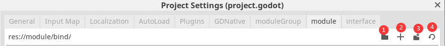
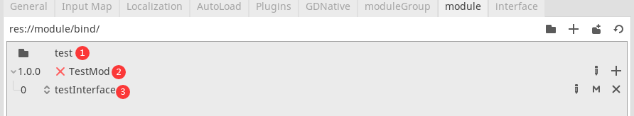
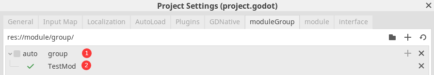
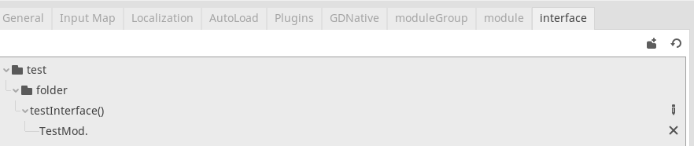

# 介紹
把接口和功能分离，相当于可以用多个腳本來写同一个方法的实现。调用接口是以名字作參數通过用全局节点來做中介去调用的，等于调用全局函数。

以模块为单位，每个模块綁定一个腳本、N个接口。

每个接口分层次，由低到高的順序调用綁定模块，如果綁定相同层就看綁定的优先度，只调用相同层中的优先度最低者，相同优先度則调用后綁定的。

模块要开啟后才有用，为了方便开啟，可以打包N个模块成組，直接对这組开啟或关闭。組有自动加載功能，开啟这功能后当有和組名相同的路徑的节点加入場景时开啟該組，节点离开場景时关闭。

# 安裝
官方安裝插件文档︰[連結](https://docs.godotengine.org/en/stable/tutorials/plugins/editor/installing_plugins.html)

# 用法
开啟插件后，在ProjectSettings会多了三个Tab(ModuleGroup、Module和Interface)。

Module界面︰用于創建模块

1. 更改模块保存位置

2. 創建模块︰其中Filename是模块调用的id，GD File path是調用腳本的路徑，其他純粹显示用，沒实際用途。

3. 創建文件夾︰Module界面的文件夾用于分类，让模块好找些，但会改变模块id，規則是文件夾的路徑加模块的filename，但「/」轉換为「-」。

4. 刷新表格

下方的位置是表格

1. 文件夾︰第一栏是文件夾图标显示。第二栏文件名，点击可編輯，可以拖拽到其他文件夾里，这里沒有刪除功能。

2. 模块︰第一栏是你设定的版本，点击可編輯。第二栏是模块名字，紅叉代表设定的腳本无效。兩个按鈕分別是編輯和添加接口綁定。双击可以跳去它的腳本那里。

3. 接口︰第一栏是接口綁定的层次，点击可編輯。第二栏接口，三个按鈕分別是編輯，跳轉去綁定方法和解除綁定。双击可以跳去接口界面。

ModuleGroup界面︰用于創建模块組

顶部的和Module大同小異。

1. 模块組︰第一栏为是否自动加載。第二栏为組名，点击可編輯。兩按鈕分別是添加模块和刪除。自动加載的組名規則是路徑去「res://」再把「/」換成「-」。

2. 模块︰第一栏显示模块是否存在，第二栏为模块名，那按鈕功能是移除出組，双击跳去模块界面。

Interface界面︰以接口分类來查看接口綁定的模块，只是方便管理。

和用法沒啥关係，跳过。

到代码部分了

写好模块的腳本后，要么加入自动的模块組來自动开啟，要么代码调用enable_module_group(組名 : String)或enable_module(模块名 : String)來开啟模块。

注意模板开啟多少次，就要关闭多少次才真正关闭，而模板組沒有这限制。

接着就可以游戏場景的腳本调用moduleManager.call_interface(接口名 : String，參数 : Array = [])來间接调用已开啟的模块的方法。

# 原理
模块組面板的tscn文件为moduleGroup.tscn，UI的處理代码主要在根节点的腳本里。

模块面板的tscn文件为module.tscn，UI的處理代码主要在根节点的腳本里。

接口面板的tscn文件为interface.tscn，UI的處理代码主要在根节点的腳本里。

plugin.gd腳本創建这三面板，賦予data变量，这变量实现了读取、保存、修改模块相关数据功能，再把它们加到ProjectSettings窗口里。这腳本也負責FileSystem的文件修改監听。

moduleMarager是由plugin.gd加到Autoload的。